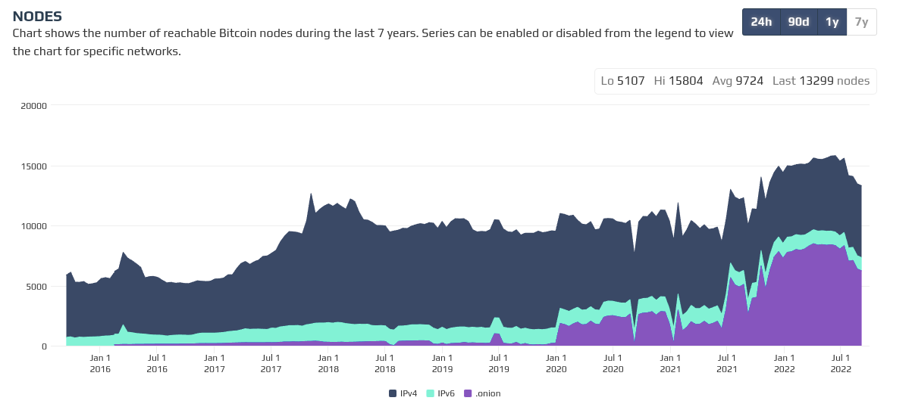
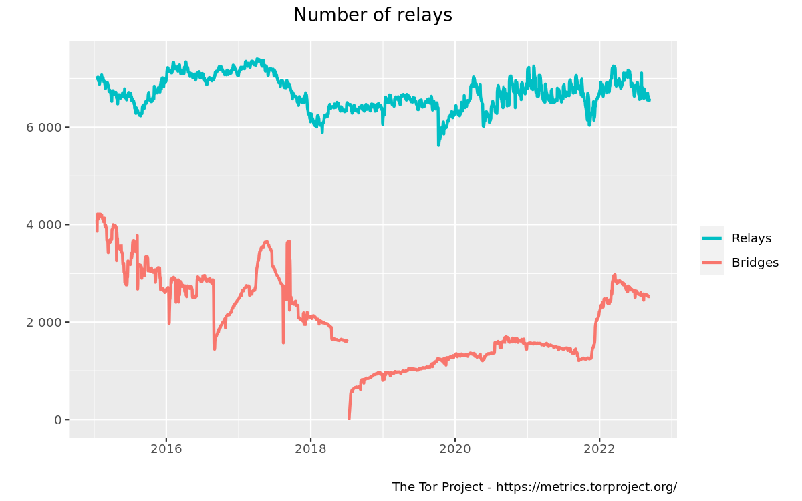

# Indra Routing Protocol White Paper

Programmable onion routing distributed virtual private network protocol with
anonymised payments to create scaling incentives.

[David Vennik](mailto:david@cybriq.systems) September 2022

> Markdown format of this document is created with [Typora](https://typora.io)
> which renders the sequence and other graphs found in this document correctly.
> The PDF format may lag from the current state of the markdown document.

## Abstract

The state of counter-surveillance technologies has remained largely unchanged in
the 20 years since the inception of the [Tor network](https://torproject.org).
The primary use case has always been obscuring the location information of users
from clearnet sites, and the more it has been used for this purpose, the more
hostile clearnet sites have become towards this network, due to its frequent use
to launch attacks on web services.

With the increasing amounts of value being transported in data packets on the
Internet since the appearance of the Bitcoin network, the need for eliminating
the risks of geographical correlation between payments and user locations
continues to rise.

However, without any way for users to pay routers without creating an audit
trail, the networks have a severe scaling problem in that in anonymising data,
there is an increase in privacy with the larger number of nodes and users, and
thus well heeled attackers have largely been able to keep pace and pluck off
high value
targets, such as
the [Carnegie Mellon University](https://blog.torproject.org/did-fbi-pay-university-attack-tor-users/)
.

Thus, it is the central thesis of this paper to demonstrate how decorrelation
between payments and session usage can be achieved and create a marketplace in
routing services which can economically increase to a size that is beyond the
capabilities of a state sized actor to fund an attack.

Indra creates mechanisms for anonymous purchase of chaumian vouchers used to
initiate traffic sessions with router nodes, which then compensates routers for
their running costs, and further, focuses on hidden services and
Bitcoin/Lightning (and potentially other Bitcoin related systems) in order to
reduce the attack surface from large actors who have thus no open justification
for censoring the network.

## Tor isn't Scaling, but Bitcoin Needs Onion Routing

For comparison, this is Bitcoin's node count:

Versus Tor in a comparable period:

It is not hard to see: Tor is not growing, it's flatlined. Bitcoin is growing.
Not only that, you can also see that onion routing is forming an increasingly
large component of Bitcoin connectivity.

## Goals of Indra Routing Protocol

Three key elements of the Tor protocol make it less than desirable in general. O

1. the establishment of circuits is quite slow, taking a large number of steps
   to "telescope" into a channel. Source routing would be preferable.

2. once a circuit is running, when it fails, the failure is opaque to the client
   side, and there is no way to provide a latency guarantee or connection
   stability. An anonymised probing mechanism would help fast recovery and avoid
   timeouts.

3. Three, as above, there is no profit motive to drive expansion of router
   capacity, and as such it has definitively flat-lined, and there is clear
   signs that a growing number of nodes are in fact operated by Bitcoin users.

Indra aims to provide a source routing mechanism with a feedback mechanism for
determining unresponsive routers in the path and a payment mechanism integrated
with the Lightning Network that produces tokens that clients can use to
construct routing paths without interactive key negotiation.

## Anonymised Session Purchase Protocol

The initial purchase of a routing session presents a chicken and egg situation.
Without an existing circuit, how does a client node acquire a token to use for
creating hops in an onion route?

For this, we borrow
from [BOLT#4](https://github.com/lightning/bolts/blob/master/04-onion-routing.md)
which we cannot use by itself as it has no provision for returning an arbitrary
package of data, nor the notion of an interacting midpoint in the loop, with the
chain going back to the sender.

It does however provide almost everything else, so a large part of this protocol
will follow the same scheme, up until the seller, at which point ASP introduces
the notion of a circular return path, which will also feature in the routing
protocol.

### Generating Keys for the Path

As described
in [BOLT#4](https://github.com/lightning/bolts/blob/master/04-onion-routing.md#shared-secret)
the sender generates a cipher for each router in the path based on a randomly
generated key for each hop, combined
using [ECDHE](https://en.wikipedia.org/wiki/Elliptic-curve_Diffie%E2%80%93Hellman)
with the routers advertised public key. The routers see a public key for the
secret being used at their hop, and can then combine it with their private key
to decrypt the message.

