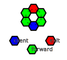

# Indranet Protocol White Paper

#### Onion routed distributed virtual private network protocol with anonymised payments to create scaling incentives.
> [David Vennik](mailto:david@cybriq.systems) September 2022 - January 2023

## Abstract

The state of counter-surveillance technologies has remained largely unchanged in
the 20 years since the inception of the [Tor network](https://torproject.org).

The primary use case has always been obscuring the location information of users
from clear net sites, and the more it has been used for this purpose, the more
hostile clear net sites have become towards this network, due to its frequent use
to launch attacks on web services.

With the increasing amounts of value being transported in data packets on the
Internet since the appearance of the Bitcoin network, the need for eliminating
the risks of geographical correlation between payments and user locations
continues to rise.

However, without any way for users to pay routers without creating an audit
trail, the anonymising networks have not grown in nearly a decade, and
thus well heeled attackers have largely been able to keep pace and pluck off
high value targets, such as
the [Carnegie Mellon University](https://blog.torproject.org/did-fbi-pay-university-attack-tor-users/) - implicated in part of what led
to the arrest of the Silk Road founder, Ross Ulbricht.

It is the central thesis of this paper to demonstrate how obfuscating
correlation between payments and session usage can be achieved and create a
marketplace in routing services which can economically increase to a size that
is beyond the capabilities of a state sized actor to fund an attack, while also
improving latency and stability of routed connections.

## Tor Isn't Scaling, But Bitcoin Needs Onion Routing

For comparison, this is Bitcoin's node count:

Versus Tor in a comparable period:

It is not hard to see:

- Tor is not growing, it has flat-lined.

- Bitcoin is growing.

Not only that, you can also see that onion routing is forming an increasingly
large component of Bitcoin connectivity.

## How Indranet Improves Upon Existing Mixnet Designs

Indranet, in contrast to other anonymising network designs, is pure [source routed](https://en.wikipedia.org/wiki/Source_routing). This means that only the clients know the full path along which their traffic moves, and relays have no influence on the path of traffic aside from failing to deliver it. It is similar in many ways to the [HORNET](./1507.05724v1.pdf) mixnet protocol.

Many of the [vulnerabilities](https://en.wikipedia.org/wiki/Mix_network#Vulnerabilities) of mixnets relate to the relays having the ability to change the path of traffic. In Indranet, relays either forward traffic as instructed, or not. To some degree, source routing creates protection against byzantine type faults, because failure to deliver and most malicious attack methods result in clients distrusting the malicious nodes, the same way as they distrust unreliable nodes. Because unreliable nodes cost clients money, effectively, malicious nodes will be quickly forgotten and end up being used by nobody.

### Active Attacks 

It is not possible for adversaries to modify packets without effectively breaking the path, as messages are integrity protected by cryptography that is opaque to other than the client and the at each layer, the relay that will forward or process the message. This can adversely effect the randomly selected next path because it may be inferred that possibly the receiver is faulty rather than the sender. The client will use probes to check the liveness and latency of the path, and by a process of elimination it will determine the sender is faulty and deprecate it from further use, potentially eventually fully blacklisting it and not sharing the node's existence with peers.

### Artificial Gap (packet dropping/delay) and Artificial Bursts

These attacks fail because the client will determine via ping probes that nodes are failing to execute the forwarding/returning of packets and this will gradually result in the malicious nodes not being shared by clients altogether, not just way down the scale of reliability. It is part of the contract of operating a relay on Indranet that your node follows the instructions given to it.

### Timing Analysis

Discovering the relationships between clients and the services they are connecting to is the essence of all of the attacks on mixnets. Indra takes several approaches to resolving this issue:

- **Packet scheduling is shuffled constantly** - Relays do not simply behave as First In First Out buffers, but rather, mix together the messages they receive. All messages have to be segmented for network transport, and as these segments are fed into the outbound queue, they are shuffled so that the ordering is broken up. This slightly increases latency but it decreases associativity between streams of packets constituting messages.
- **Deliberate delays** - This is a tactic that is more often seen in email mixnets but can be used to a degree in lower latency mixnets like Indranet because not all traffic is time critical. Bitcoin transactions and blocks are relatively time critical, but DNS requests can comfortably take up to 100 ms without disrupting the functioning of ancillary centralised type services using them (IE, DNS for web traffic). Email is also a potential service type on Indranet, and because it is inherently slow and non-interactive, the delays can be even longer, potentially several seconds to deliver, and so the segments of the packets as they pass through will not have strong timing correlation. The delays are defined by the client, and raise the cost of the data from a regular non-delayed message by a percentage in proportion with the length of the delay.
- **Client-side anonymity** - Indranet does not also expose relays to uncompensated exposure to entities outside of the network. Potentially Indra can implement Tor style web browser anonymisation, but because such traffic is often used to attack websites and web services it is usually going to be only a matter of time if a free cloak for malicious traffic becomes blacklisted by inbound connection filters on these services. Most Indranet traffic will be passed to decentralised servers, such as Bitcoin, Lightning and IPFS, which do not have a central point of observation either.

## Why We Need Indranet

Three key elements of the Tor protocol make it less than desirable in general.

1. **High Latency** - Establishment of circuits is quite slow, taking a large number of steps
   to "telescope" into a circuit.

2. **Low Reliability** - Once a circuit is running, when it fails, the failure is opaque to the client
   side, and there is no way to provide a latency guarantee or connection
   stability. It is unsuitable for interactive *and* long living connections.

3. **Poor Scaling Incentives** - There is no profit motive to drive expansion of relaying
   capacity, weakening anonymity by not expanding the anonymity set to cope with a rise in the number of users. As the charts showed in the foregoing, there is around 8,000 nodes, of which 6,000 are relays and the remainder private bridges, but the average daily user count of Tor is around 100,000 users. Both numbers could be a lot higher if running a relay wasn't a money losing exercise, and if the system could handle interactive grade latency and very long living connections.

Tor is a poor solution for a very limited subset of the use cases that
benefit from the security of route obfuscation. Indra aims to provide what Tor
has definitely now failed to achieve for a large majority of internet users:
location privacy.

Indranet does not aim to compete with Tor for the use case of tunneling out to clear-net websites and services: the focus is on obscuring the source of traffic within decentralised, peer to peer protocols like Bitcoin, Lightning Network, Bittorrent, IPFS, and other similar, decentralised protocols.

## General Principles of Indranet Protocol

There is four main types of traffic in Indranet:

1. **Network Protocol Chatter** - sharing lists of known network nodes, their advertised exit services, and collaboratively generated statistics on bandwidth and uptime, and their long lived public keys for session initiation.

2. **Purchase of bandwidth sessions** - Combining the use of Lightning Network to perform payments to proxy nodes, and specially formed layered encryption of messages, enabling clients to acquire tokens that grant users the ability to relay arbitrary traffic through relays.

3. **Liveness diagnostics** - In order to keep track of the state of relays on the network, clients send out regular 3 hop messages that circle back in a diamond-shaped topology that they use to acquire the liveness state of relays. This requires the relays to actually do work, so it costs a small amount, but provides reliable data about the state of relays the client has sessions with.

4. **Relaying messages to decentralised network services** - because all relays on Indranet, and even clients, must have a Lightning server and thus a full or light (Neutrino SPV node) Bitcoin node, providing anonymised messaging to these protocols is the first type of exit traffic. Integration with other decentralised services will proceed later, and enable uploading or accessing content on networks like IPFS and Bittorrent, and eventually also to include decentralised messaging, social network, software/media repository hosting, and any other network, including federated and semi-decentralised systems like "cryptocurrencies".

## Protocol Concepts

### Packet and Message Encryption

Indranet uses a message encryption scheme based on [Elliptic Curve Diffie Hellman](https://en.wikipedia.org/wiki/Elliptic-curve_Diffie%E2%80%93Hellman) (ECDH) key exchange.

The message and packet headers contain the following elements:

- **Message checksum** - 4 bytes of the truncated hash of the remainder of the message or packet, for preventing tampering and ensuring integrity of the message.
- **Initialisation Vector** - cryptographically secure random value used for the payload encryption.
- **Cloaked public key** - generated via the use of a strongly random 3 byte value that is concatenated with the receiver's public key, and the first 5 bytes of the combined hash is concatenated to the 3 byte nonce value to prevent inferring association of a stream of message packets with each other. This key also acts as a session identifier, and must be cloaked in order to not provide information to malicious nodes who would then be able to correlate messages.
- **Signature** - The hash of the payload data is signed with a private key that formed the other half of the ECDH enabling securely conveying the encryption secret to the intended receiver over an insecure network. These keys are generated using an algorithm that efficiently generates secure private keys that are correctly on the [secp256k1](https://en.bitcoin.it/wiki/Secp256k1) elliptic curve.

### Signing/Encryption Key Generation and Message Segmentation

The signatures on messages must be different for each subsequent message, and when a message exceeds 1382 bytes (based on a 1410 byte MTU, typical for mobile networks) the message will be segmented into pieces of this size, the last packet padded out with random based hash chain generated noise.

These signing keys are generated by creating two secure, secp256k1 private keys, the base and the secondary, and the base is scalar summed with the secondary to produce a new key, and this new key is then used again the same way for subsequent keys.

This scalar sum operation guarantees that the new private key is also a valid secp256k1 curve point (values not in the curve weaken the encryption), and can be performed very quickly without the resultant key being outside of the curve. Deriving the public key takes approximately the same time but a signature also maps to a message hash so it acts as a MAC (message authentication code) as well as providing half the encryption key to the receiver.

This scheme helps guarantee that once messages are encrypted, even if an attacker gains access to the network handler packet cache they cannot access the encrypted payload data.

### Onion Path Topology

Indra uses a single topology that provides two hops between the client and the exit/endpoint being connected to. Only two are required to provide optimal anonymity - the first hop can infer it received a message from a client, but the second hop cannot, as it did not, and while most clients are not also providing relay service, a lot will use it, especially hidden services or multi-server setups that forward inbound requests one or more separate servers providing the services offered at the exit.

Because it is mostly not possible to fully hide the fact that a node is a client, there is separate sessions for each of the 5 hops in the circuit. First and last hop sessions can make session balance queries directly, whereas for the other 3 hops it uses the standard path, except in reverse for the second last, and randomly, exit point to perform these queries, and the last two hops and the return hop carry back the response.

Because Indra is source routed, every single request can pass through different paths, eliminating observable correlations between clients and relays for attempts to unmask users, and eliminating any discretion a relay can have about where traffic is forwarded - it either goes, or it does not. Attempts to attack users  anonymity by delaying or dropping messages by evil relays will violate expected relaying performance parameters and the offending nodes will be downgraded in their selection frequency as punishment.

### Proxy Messages

**Proxy** messages are the standard for messages where the **client** is sending messages through a proxy, called the **exit**. Each of the colours shown in the diagram represents the message type. 

- **Forward** messages are purely constructed by the **client**. They are to be carried forwards to a specified IP address, which will be the next hop in the path, or an **exit**, and use the **forward** key provided by relays on purchase. The next hop will decrypt the payload, which can contain either another **forward** or an **exit** message.
- **Return** messages consist of a preformed header encrypted to three secondary keys provided in the purchase process, derived from key pairs embedded in the encrypted layers of the header, called "return" keys, and three ciphers that are to be used sequentially to encrypt the reply message, and the cloaked address in a **return** relay message header layer combined with a public key the client generates to secure the message.

	The provided ciphers for a layer uses the second key known to the **return** relay and client but not the **exit** relay, thus they are unable to unwrap the encrypted message giving the address to the next hop, but by the header and a type byte in the message the **return** hop node then switches to the secondary key that the **exit** doesn't know, that corresponds to the cloaked key, which generates the cipher the **exit** hop was given, combined with the public key visible in the first header. (This is based on the reply messages in Sphinx).

	The second **return** hop also uses this alternate key in order to conceal to the relay whether it is first from the exit or second, the last header only has a packet identifier, because the cipher for the payload is cached by the sender alongside the identifier. This slightly elaborate scheme enables pure forward source routing with the only caveat that exits know they are exits, but **forward** relays don't know whether they are receiving from client, or first, or second hop, and likewise **return** relays can't know whether they are receiving from an exit or sending to a client.

	When a client lacks the **forward**/**return** key pair from a session purchase, it uses a 5 hop circular forward chain which delivers an identifier and the three required ciphers, which the relay will cache for a time expecting a purchase message with which these keys will be used to create the **return** onion encryption.
- **Exit** messages are a special type of message. They contain three symmetric cipher keys that must be used in sequence over the payload, and then appended to the preformed routing header with the return byte flag set.

### Ping Messages and Path Failure Diagnosis

Because there is several intermediaries in paths in Indranet, and a failure for the response or confirmation to arrive in a timely fashion can mean a failure in any of the nodes in a circuit. The first and last hops can be openly probed for operation using a Get Balance query (which is a single hop out and back), but the others must be diagnosed differently. The reason being that using relays for the outer 3 hops at the same time as using them as first hops would potentially unmask the location of the client associated with the session.

Thus, the ping message, which consists of 5 hops using the forward-only relaying instruction message, can be sent out several times to pass through these inner hops of the failed path. The failing node will not forward these messages and thus the confirmation of the ping will not arrive back at the client. Of course it can be that the randomly selected other relays in the ping path also are failing, which can then require further probing, using sessions that already proved to work until the one or more hops in the failed path are identified. While the process of diagnosis is occurring, Indra will not choose the 5 relays in the failed path until the diagnostic is completed.

When a delivery failure occurs, Indra will inform the client application by returning a connection reset by peer message so the client retries, and Indra then uses a different path that does not include any of the relays from the failed path until they are diagnosed.

### Client

Unlike Tor and other anonymising protocols, every client has the capacity to act as an **exit** for traffic while it is online, for at minimum, Bitcoin and Lightning Network messages. They advertise themselves as "unreliable" exit nodes, this descriptor indicating that they are intermittently offline, and do not attempt to stay online. This will also mean they don't get a lot of traffic but users on the network will be able to use them when they see a status update on the peer to peer network.

This increases the size of the anonymity set for these types of messages, and can include more exit protocols if the user is using them, such as IPFS and other decentralised protocols. It also makes it relatively simple for users to create small, low volume channels for Lightning Network, enabling direct, self-custodial LN payments.

In the diagram above, we distinguish the **client** with blue, but to the nodes before them in the circuit, they appear the same as the one sending, so, **forward** relays see a forward message to **client** and **exit**, and **return** relays see return, and **return** hops see **exit** as return.

All messages look the same as packets in transit, and have no common data between them to establish relationships other than timing. For this reason, the network dispatcher shuffles packets as it sends them out as well.

## Payment for Traffic

Using [Atomic Multi-path Payment](https://docs.lightning.engineering/lightning-network-tools/lnd/amp) (AMP), relays advertise their LN node public keys alongside their Indra identity keys, they send a message constructed as follows:

- Preimage hash of the forward and return private keys that will be delivered after payment to prove payment and provide the keys for handling return messages.
- Amount of bytes the payment is for.

The payment will be for an amount of satoshis in accordance with the rate advertised by the seller. There is no direct return confirmation in this process. As with the rest of Indranet's design, the client is in control of everything, tightening the security.

In the initial bootstrap, the client will send out 5 such payments to establish enough hops to form a secure path. With 5 payments made, relating to 5 sets of **forward/return** keys by the hash of these keys being the preimage used.

This payment delivery onion can deliver 1 to 5 key sets, to handle all possible cases, the only difference between them being the additional key layer in each hop, followed by a forward for the next, the message type is named "SendKeys", which is what follows an LN AMP, and the bundled LND server then relays the bytes amount and preimage to Indra which then holds this to confirm the **SendKeys**.

### Sessions, Depth and Direction

The nodes that are directly adjacent, the one the onion is sent to by the client, and the one that returns a response to a client, can easily associate a session key with the IP address. The second level of depth is less problematic in this way, but has weaker anonymity than the exit hops.

Thus, sessions have a value associated with them to indicate what depth they can be used, and which direction. A simple signed byte integer is sufficient to cover the usual 3 layers of depth. In a ping message there is 1, 2, and -1. In an exit message, there is 1, 2, 3, -2, -1.

This also indirectly brings up the subject of the amount of bandwidth that would be paid for in each case, since each relay needs a session for each of the 5 positions it might be selected to use. Because `AMP` is a fast and relatively cheap operation, it also reduces the risk of loss due to a node failing to deliver service, as the cost paid is low per unit and this observed failure will reduce the chances of the node being selected for future work.

As a relay dutifully performs its service it can then be selected to be used for further sessions at different positions and possibly at larger amounts of bandwidth at a time to reduce the per-transaction cost overhead.

## Proof of HODL Consensus

Following from the model of loyalty building between customers and businesses in the open market, a number of consensus rules and protocols help reward honest nodes and reduce the impact of bad behaviour in both clients and relays that harm the security and value of the network.

Decentralised, and especially anonymous networks have a primary common vulnerability to Sybil attacks, since identities can be created in large numbers and used to overwhelm a network with false information.

In order to prevent this attack there is a number of rules that honest peers follow, and mechanisms by which peers on the network evaluate each other on the relay and client side both.

1. To rate limit the creation of new nodes on the network, nodes must make an on chain Bitcoin payment with a time delay back to themselves, and after a period of time they can then repeat the transaction, the latest head of the chain of transactions tied to the original TXID must be active in order for nodes to use the relay.

	The size of the value of the time locked UTXO is a factor in node selection to weight probability, lower than the factor of age in first time usage by clients.

	The UTXO hash is signed by the UTXO's private key in the node identity, proving ownership. It leverages the strong security of Bitcoin to anchor a relay identity to a definite time as well as raising the new relay identity creation cost in the short term.

	The fees a relay pays to renew can be zero, but this will reduce their ranking during the interim periods after one expiry and the next activation.

	Bigger UTXOs expire later than smaller, so the more a relay defers spending the more reliable they intend to be, and cutting down their transaction fee overheads. Sybil attacks rely on cheap identities, this creates a dilemma for attackers, who must lock up more for longer if they want to be more likely to win new loyal client customers, and putting a cap on how many Sybil clones they can create for any hypothetical get paid but not deliver attacks.

	The expiry times must conform to the rules of the network, as a ratio of satoshis and blocks, some deviation is allowed, but the point is that smaller time locked spends must expire sooner and thus cost more in transaction fee overhead, it is just better to sink more than less, as well as it raising the probability of first time selection by clients.

2. The age and cumulative time active for a TL UTXO is also used as a factor in the evaluation of the reliability of a peer. No matter how big the UTXO the clients will not pick it with higher probability until the relay has remained operational in a time/value weighting formula.

3. For relays a client has used, the ones with the highest rates of fulfillment are weighted above all else. The previous two criteria are more used for distributing risk of first time use of a relay, so as to minimise the unfulfilled sessions versus delivered. At the same time, a client also needs to slowly shift its session usage around, and thus also try new relays out, and intermittently cease using some of its known and trusted relays for traffic for some period, which is necessary also for the feedback system described in the next section.

### Anonymous Probabilistic Feedback Propagation

In order to create a feedback loop between relays and clients, both relays and clients share random selections of known peers with each other that have been given a weighted probability of selection in the message of this small subset.

The p2p layer ensures that any node can discover with fairly high convergence of the current full list of peers on the network if desired. This is a separate process that works a little bit like "shout-outs" in social media.

In order to prevent the correlation of esteemed peers to a client's currently active traffic, the most recent activity and volumes of traffic over their circuits is weighed to not leak current connection data in close time proximity to this chatter. 

The messages are only sent out once a day, and in proportion with the time known and the amount of first/last hop connection traffic sending these "shout-outs" are then combined with the frequencies of clients' recommendations lists allows long serving customers running honest clients to evaluate their peers in a way that doesn't either unmask them or enable spammy advertisement from constantly new clients attempting to poison these scores.

>  With the combination of a form of lightweight bonding, timestamp anchoring to Bitcoin with proof of ownership, subjective histories of fidelity and a probabilistic feedback mechanism, it will be difficult to find a way to make income from Indranet without actually delivering service.

## Relay to Relay Traffic

Messages are segmented into 1382 byte segments and reassembled by relays when they receive them. The relays return an acknowledgement being a signature on the hash of the packet data (which includes the checksum prefix), and these are dispatched in a stream after shuffling by the sending relay, as well as interleaving messages passing to the common next hop when this happens. 

The relay receives the batch of packets, and when it receives enough pieces to reassemble it, according to the error correction data in the packets, and succeeds, reads the message instructions and does as is requested, either a **forward** or **return** message, the difference being described previously. 

### Relay to Relay Encryption

In order to further secure traffic, relays in their chatter with each other provide private relay-to-relay keys to use for message encryption, which are rolled over at least once a day. 

### Dynamic error correction adjustment for Retransmit Avoidance

Based on the conditions of the paths between two relays, by the ratio of packet loss the nodes adjust the error correction to use in order to maintain a margin above the current loss rate, built using a moving average of successful deliveries versus failed.

## Client Path Generation Configuration

A flexible configuration system for selecting paths and exit points is required to cover several different types of use case of obfuscated traffic paths.

- Geo-location based exit and route hop selection:
	- Users may need to avoid using exits within their own or some specified outside jurisdiction.
	- Users may specifically want their exits to emerge in a specified geographical region.
	- Users may want to specify, or avoid selecting intermediate paths in a list of specified geographical regions.
- Selection of specific routers for exits for a given protocol:
	- Using a user's own servers, this can be generalised to allow remote access to a server controlled by the user.
	- A company may provide specific services that users can access at a given set of addresses, whether IP based or domain based.

## Hidden Services

Because Indranet is source routed, the complexity of implementing hidden services is greatly reduced. Instead of requiring a pair of 3 hop paths connecting at a rendezvous points, hidden services send out reply header messages that clients can use to route traffic to them, and the rendezvous points then advertise that they are currently handing out reply headers for a hidden service address. This easily halves the latency of hidden service access.

It is safe for a hidden service to send out connection headers similar to the format of exit messages, an onion header and a set of 3 ciphers generated out of the same public keys used at each hop and the nonce used for the header, with which a client can use these ciphers to encrypt to the payload keys their payload, and the header will plot the path back to the hidden service, each hop unwrapping their part of the encryption.

A hidden service selects a number of rendezvous relays to cache these requests, and they then send out an update to a separate rendezvous address DHT that peers can use to request a list of rendezvous points that are delivering hidden service headers for a given hidden service address. The addresses are just a public key, 33 bytes encoded with a check using Bech32 encoding.

The hidden service sends new return paths to the rendezvous, keeping a fresh supply of them available. Note that the sessions encoded into the reply headers use sessions that are paid for by the hidden service. However, the payload clients send out encrypted to these reply headers have their own return path, consisting of sessions that the client has paid for, so there is a roughly equal cost for both clients and hidden services.

Clients will request new reply headers every minute or so while connection is active to the hidden service to keep the paths from forming any pattern.

To prevent clients from retaining old reply headers after they are expired, the reply headers contain a timestamp at the very end of the header expected at the front of the message, pre-encrypted to the payload key and the two further layers of encryption of the first two hops of the path.

Hidden services will periodically rotate their rendezvous points, probably once an hour or so, depending on the propagation delay of the DHT, in order to further reduce the patterning of hidden service access traffic on the setup side.

### Fully Anonymous VPS Hosting

With the use of Indranet's hidden services protocol, in theory a user can establish an account with a remote VPS rental provider that uses Indranet, with an package that includes a pre-installed instance of Indranet (not providing relay service, but appearing in the peer DHT), running a certificate authenticated SSH endpoint, and then install whatever applications they want, hook them up to the server's service configuration, and thus remain completely anonymous and untraceable to the public IP of the VPS. In this plain configuration the user knows the IP address of the server's Indra node.

Or it can even go one step further, where even the server IP address is hidden, connected by a point to point connection to the provider's network infrastructure, which further increases security against an application breach leaking the IP address of the hidden services running on it. Neither the provider, or the client know anything about each other, and thus cannot be connected together, and likewise, none of the clients of the hidden service will reveal any location data by default to the applications on the server.

## Proxy Service

The client will run a Socks5 proxy, which users then set up as their web browser/other proxy for connections. This proxy will make DNS requests via Indranet for the names in the requests, whether Indra hidden service addresses or clearnet addresses, forwarding the name resolution request out to random Indranet relays, who send back the IP address replies.

Requests for forwarding to a specific Indra relay can be specified by an address matching the relay's IP address, or the zero address, meaning randomly select the exit, or a regular domain name for the case of relays that provide tunnel exit services.

Relays that wish to provide tunnel exit service simply place a Socks5 proxy listening on their localhost service ports, inbound connections for these services are then forwarded through the proxy which then resolves names via Indra to dissociate this request from the exit, and forwards the messages and routes the replies back to the clients using the exit header reply segment.

In this way, a user can run a bitcoin or lightning wallet or other client application, and set its proxy to the Indra client's proxy and they will then be able to tunnel out to the endpoint, in the case of Indra nodes offering this service, or via tunnel exit services for addresses not part of the Indranet swarm, no modification required except to add the proxy configuration to the server, or even to the operating system settings to enable proxying automatically for any application that knows how to use the OS proxy setting.

For software that does not have the ability to use a proxy, the Indra client also opens listeners on localhost addresses for configured port numbers, and then using server configurations' "connect only" type setting, establish a path to a single, randomly chosen Indra peer that provides this service, and of course many of them can be set up as needed. The caveat to this is that during a session, if it were desired to change the endpoint the path leads to, this has to be tolerated by the protocol, that it be ok for an endpoint change to occur periodically, or on every request.

Peer to peer applications may or may not tolerate the apparent change. For services that have no concept of association, like a Bitcoin or other distributed application service RPC API, it is fine for each new request to take a different path and go to a different endpoint. Configuration will allow fixed endpoints (that don't change during a run), a rotating change of endpoint, and a period in which the endpoint is rotated if it is set to rotate, or a new endpoint each time.

However, since most p2p applications understand the use of Socks proxies, this won't be a frequent requirement, and is of lower priority for implementation than the straight Socks5 proxy.

## Private Relay Services

To enable users to use Indranet as a transport for accessing private servers, deployments using the `Neutrino` SPV bitcoin node and `lnd` can configure a public key certificate that they can use with a private key, in a similar way to SSH certificate encryption, to enable routing from any client to their specified node identified with its IP address, where there is a relay running at that IP address with the public key registered as enabling access to forward connections to a defined loopback address where the hidden service is running.

This will enable SSH, FTP, and similar services for users to be accessed via Indra, while preventing third parties from identifying the origin of access to the server. This will also enable things like remote desktop access, but it does not include rendezvous routing.

## The Indra Tax

Here at Indra Labs we like to call a spade a spade, and we will be establishing in our distribution of the Indranet clients and relays the default establishment of Lightning channels through our peer to peer network seed nodes, which will charge market-typical routing fees to connect clients to the Indranet swarm's Lightning nodes and enable payments. Because we make this the default, and by default relays only connect to other relays and the seed nodes, effectively we can levy a kind of toll for the delivery of payments.

We intend to also offer the option for investors to, preferably independently, run seed nodes, under the conditions they request, which can include our promotion of them on our website and communications. It is better that there be several independent entities involved in this, and of course the fees their seed nodes collect will be part of their reward for this service.

Session payments are always routed through long paths, as permitted by the Lightning Network protocol, selecting a seed node first and then to several intermediary nodes in the swarm before reaching the destination. Users will be able to verify by enabling payment logging, and see a recent history of payments and the hops that the Lighting node in the client used to construct the payment message.

The channels between clients and seed nodes are bidirectional, and users can then add to their client balance by sending payments to an invoice their client creates for adding funds to it. The amount of satoshis in their channels will be at their discretion, though the client will alert them that their channel is empty in order to prompt the user to fill it back up. Seed nodes will collect routing fees on both directions, of course.

The size of Indra client Lightning wallet balances is dictated by the user, but in general it does not need to be very large, as it will likely process maybe several US dollars worth of traffic a day for most users, it is just a matter of convenience to make them larger. Rather than close them and establish new ones, when users want to increase their wallet balance they can simply establish more channels to the seeds, and avoid closure fees. Since a user is not going to pay into their wallet unless the client is running, these channels are ok to be offline the rest of the time.

Users can also configure their client's Lightning node to open other channels to the Lightning Network as they wish, by pointing their wallet application to the IP address of their client, or if they are technically inclined, via `lncli`, as we are using `lnd` as our primary LN node due to it being written in the same language as Indranet itself. Payments into their Indra LN wallets can thus also pass through other channels than the seed nodes' channels, evading the inbound transaction fee to our seeds, although in general that just means paying someone else.

Indra's channel management system will automate most of the task of balancing channels, shifting balance from depleted paths into ones that are not yet depleted, to ensure there is as many routes as possible in case seed nodes happen to be offline at the time of a payment.

-----

# Fin
